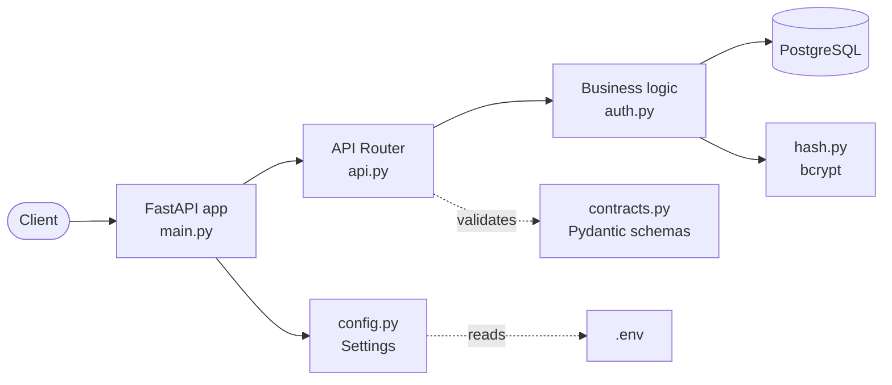
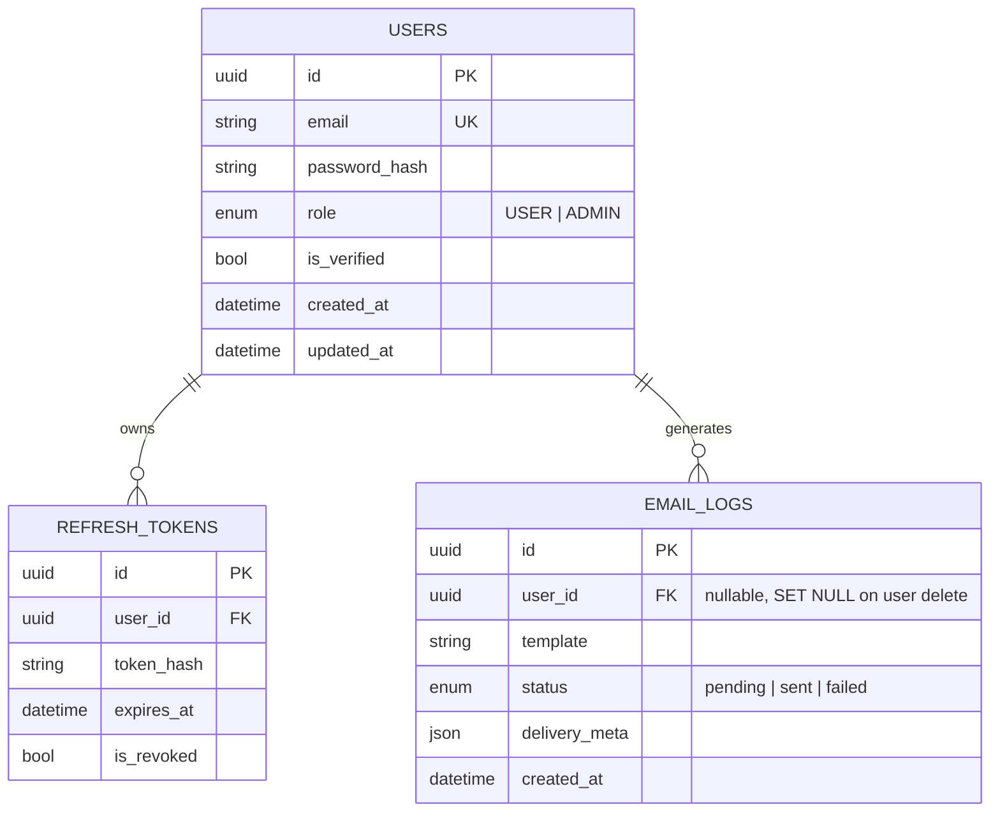
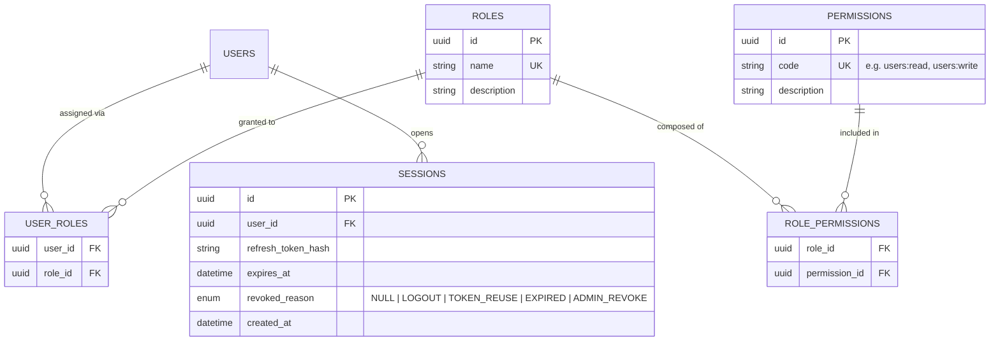
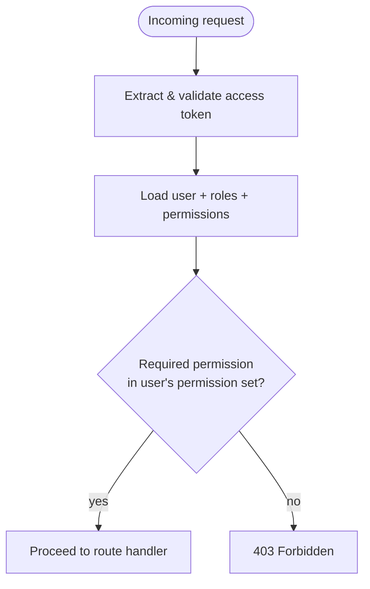
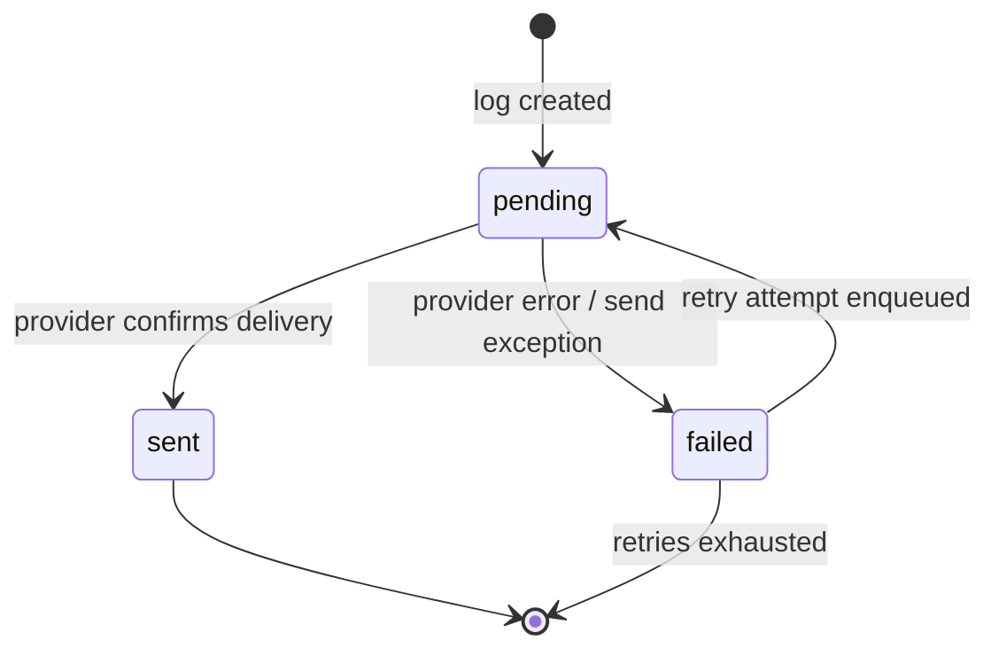
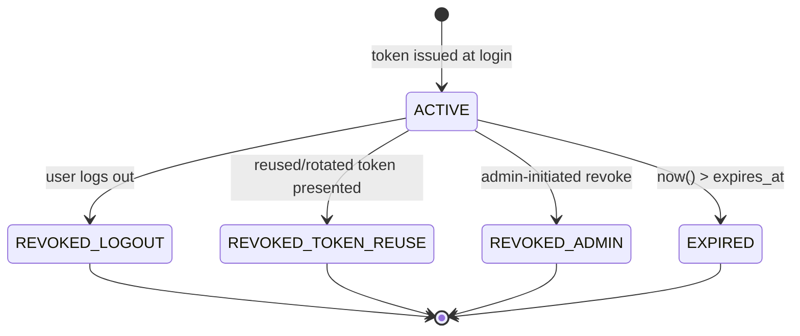

# Template: RBAC + Multitenancy Auth

**Status:** 🟡 In Progress · **Last updated:** 2026-07-21 · **Owners:** see [Iteration Log](#iteration-log)

A general-purpose, tenant-ready authentication and authorization backend built with **FastAPI**, **SQLAlchemy (async)**, and **Alembic**. Designed to be forked/tailored per project: swap the domain models, keep the auth + RBAC skeleton.

> This README documents two things side by side — what is **implemented today** (source of truth, verified against code) and what is **planned** per the current sprint outline (target design, not yet built). Each section is labeled so contributors don't confuse the two.

---

## Table of Contents

1. [Architecture Overview](#1-architecture-overview)
2. [Project Structure](#2-project-structure)
3. [Data Model](#3-data-model)
4. [Security & RBAC](#4-security--rbac)
5. [Email Log State Machine](#5-email-log-state-machine)
6. [Refresh Token Lifecycle](#6-refresh-token-lifecycle)
7. [Database Migrations (Alembic)](#7-database-migrations-alembic)
8. [Configuration & Environment](#8-configuration--environment)
9. [Toolchain](#9-toolchain)
10. [Onboarding: Where Do I Add Things?](#10-onboarding-where-do-i-add-things)
11. [Roadmap](#11-roadmap)
12. [Iteration Log](#iteration-log)

---

## 1. Architecture Overview

### Stack

| Layer | Technology |
|---|---|
| Web framework | FastAPI |
| ORM | SQLAlchemy 2.0 (async) |
| DB driver | `asyncpg` (PostgreSQL) |
| Migrations | Alembic |
| Password hashing | `bcrypt` |
| Config | `pydantic-settings` |
| API docs | Scalar (`/docs`) |
| Linting/formatting | `ruff` (+ `pre-commit`) |
| Dependency management | `uv` |

### Request flow



**Current implementation status:** only one endpoint exists — `POST /users` (user creation). Login, logout, and permission-checking middleware are on the roadmap (see [§11](#11-roadmap)).

### Security layer (as implemented today)

- Passwords are hashed with `bcrypt` (`hash.py`) — never stored or compared in plaintext.
- `User.role` is a simple `StrEnum` (`USER` / `ADMIN`) stored directly on the `users` table.
- `RefreshToken` rows exist and are linked to a user, with an `expires_at` timestamp and an `is_revoked` boolean flag.

**Important gap:** there is currently no code path that *issues*, *validates*, or *revokes* a refresh token, and no field capturing *why* a token was revoked. The target design for this (with `LOGOUT` / `TOKEN_REUSE` reasons) is documented in [§6](#6-refresh-token-lifecycle) as a build target, not a description of existing behavior.

### Toolchain

- **`ruff`** — linting and formatting. Run `ruff check .` and `ruff format .` before committing. `pre-commit` (see `.pre-commit-config.yaml`) runs this automatically on staged files.
- **`alembic`** — schema migrations, driven off the SQLAlchemy models in `app/models.py`. See [§7](#7-database-migrations-alembic).
- **`uv`** — dependency resolution/locking (`uv.lock`), faster drop-in for `pip`/`poetry` workflows.

---

## 2. Project Structure

```text
templates/rbac-auth/
├── app/
│   ├── __init__.py
│   ├── main.py             # FastAPI app instance, lifespan, Scalar docs route, router mounting
│   ├── api.py               # Route definitions (POST /users, GET /admin/dashboard example)
│   ├── auth.py               # Business logic for auth flows (currently: create_new_user)
│   ├── config.py             # Pydantic Settings — loads .env into a typed Settings object
│   ├── contracts.py           # Pydantic request/response schemas (API boundary types)
│   ├── database.py            # Async engine, session factory, declarative Base, get_db dependency
│   ├── guards.py               # RolesGuard — reads @Roles metadata, enforces it against the current user
│   ├── hash.py                # Password hashing/verification (bcrypt)
│   ├── models.py              # SQLAlchemy ORM models (User, RefreshToken, EmailLog)
│   ├── roles.py                # Role re-export + the @Roles(...) decorator
│   ├── security.py             # JWT create/decode, get_current_user ("passport" payload)
│   └── tests/
│       ├── tests_main.py      # API tests
│       └── test_roles_guard.py # Verifies admin=200, user=403, no-token=401 on a guarded route
├── migrations/
│   ├── versions/
│   │   └── cfa269117122_initial_migration.py
│   ├── README
│   ├── env.py                 # Alembic runtime config — imports Base.metadata for autogenerate
│   └── script.py.mako          # Template used to generate new revision files
├── .env.example                # Template for required environment variables
├── .gitignore
├── .pre-commit-config.yaml     # ruff hooks run on commit
├── .python-version
├── alembic.ini                 # Alembic entrypoint config (points at migrations/)
├── pyproject.toml               # Project metadata, dependencies, ruff config
├── uv.lock                      # Locked dependency graph
└── README.md                    # This file
```

### Annotated core files (`app/`)

| File | Responsibility | Depends on |
|---|---|---|
| `main.py` | Creates the `FastAPI` instance, wires up lifespan, disables default docs, exposes Scalar docs at `/docs`, mounts `api.router` under `settings.API_V1_STR` | `api.py`, `config.py` |
| `api.py` | Declares HTTP routes and their request/response models; delegates all logic to `auth.py`; guarded routes use `@Roles(...)` + `Depends(RolesGuard())` | `contracts.py`, `auth.py`, `database.py`, `guards.py`, `roles.py` |
| `auth.py` | Business/domain logic — DB reads/writes, uniqueness checks, error handling | `models.py`, `hash.py`, `contracts.py` |
| `contracts.py` | Pydantic schemas — the **only** shapes that should cross the API boundary | — |
| `models.py` | SQLAlchemy ORM table definitions and enums — the schema source of truth for Alembic autogenerate | `database.py` |
| `database.py` | Async engine + session factory + `Base` + `get_db()` FastAPI dependency | `config.py` |
| `config.py` | Typed settings loaded from `.env` via `pydantic-settings` | `.env` |
| `hash.py` | Password hashing/verification helpers, isolated so the hashing algorithm can change in one place | `bcrypt` |
| `roles.py` | `@Roles(*roles)` decorator — attaches required-role metadata onto a route handler function | `models.py` (re-exports `UserRole` as `Role`) |
| `security.py` | `create_access_token` / `get_current_user` — JWT issuing and decoding; the "passport payload" source | `config.py`, `roles.py` |
| `guards.py` | `RolesGuard` — reads `@Roles(...)` metadata off the matched route and enforces it against `get_current_user()` | `roles.py`, `security.py` |

**Rule of thumb for contributors:** a new feature almost always touches these files in this order: `models.py` → `contracts.py` → `auth.py` → `api.py`. To lock a new endpoint behind a role, add `@Roles(Role.X)` above the route decorator and `Depends(RolesGuard())` as a parameter — no changes needed to `guards.py`/`roles.py` themselves. See [§10](#10-onboarding-where-do-i-add-things).

---

## 3. Data Model

### Current schema (implemented)



Notes:
- `EmailLog.user_id` uses `ondelete="SET NULL"` — email logs outlive the user they were sent to, for audit purposes.
- `RefreshToken.user_id` uses `ondelete="CASCADE"` — tokens are meaningless once the owning user is gone.
- `role` and `status` are stored with `native_enum=False`, i.e. as plain strings with a CHECK constraint rather than a native Postgres `ENUM` type — this makes adding new enum values a simple migration instead of an `ALTER TYPE`.

### Target schema — RBAC + multitenancy (planned, not yet migrated)

Per the sprint outline, the following tables are the intended next step to move from a single `role` column to true many-to-many RBAC:



This is the design the RBAC middleware (§11 roadmap) should be built against — a user's effective permissions are the union of permissions across all roles assigned to them via `user_roles` → `role_permissions`.

---

## 4. Security & RBAC

### Current state (implemented)

Route-level authorization is now a **declarative metadata guard**, not inline `if` checks in controllers:

- **`app/roles.py`** — the `@Roles(*roles: Role)` decorator. It attaches the required roles directly onto the route handler function as an attribute (`__required_roles__`). FastAPI has no built-in metadata/reflection layer (unlike Nest's `Reflector`), so this attribute-on-the-function is the mechanism that stands in for it.
- **`app/security.py`** — `get_current_user`, a dependency that decodes a JWT bearer token and returns a `CurrentUser` (`id`, `role`) built directly from the token claims. This is the "passport user payload" — the guard trusts the token's claims rather than re-querying the database per request. `create_access_token` exists for issuing tokens; wiring this into a real `/login` endpoint is still open (see [§11](#11-roadmap)).
- **`app/guards.py`** — `RolesGuard`, a callable FastAPI dependency. It reads the matched route's endpoint off `Request.scope["route"].endpoint` (FastAPI's closest equivalent to Nest's `ExecutionContext`), pulls whatever roles `@Roles(...)` attached to it, and compares them against `current_user.role`. No roles attached → guard is a no-op (any authenticated caller passes). Roles attached but not matched → `403 Forbidden`. No valid token at all → `401 Unauthorized` (handled by `get_current_user`, not the guard itself).

Example usage, from `api.py`:

```python
@router.get("/admin/dashboard", tags=["Admin"])
@Roles(Role.ADMIN)
async def admin_dashboard(user: CurrentUser = Depends(RolesGuard())):
    return {"message": "Welcome to the admin dashboard", "user_id": str(user.id)}
```

This is verified behavior (see `app/tests/test_roles_guard.py`): an `ADMIN`-issued token gets `200`, a `USER`-issued token gets `403`, and a missing/invalid token gets `401`.

**Scope note:** this enforces the *current* single-enum `User.role` column (`USER`/`ADMIN`). It does **not** yet implement the many-to-many `Role`/`Permission`/`RolePermission` schema described below — `RolesGuard`'s comparison (`current_user.role not in required_roles`) will need to change to a permission-set membership check once that schema lands, rather than a direct enum comparison. That migration is tracked in [§11](#11-roadmap).

### Target design — full permission model

The planned permission-check flow once `Role`/`Permission` tables exist (per sprint outline: "Middleware for permission authentication"):



`RolesGuard` above is the enforcement mechanism this flow will run through — only the "Lookup" step changes (from a single enum field to a joined permission set), not the guard/decorator pattern itself.

### Multitenancy note

This template is intended to be tailored per project. If the target project needs multitenancy, the recommended pattern is:
- Add a `tenant_id` (or `organization_id`) foreign key to `users`, `roles`, and any tenant-scoped domain tables.
- Scope `Role`/`Permission` lookups by tenant so two organizations can define the same role name independently.
- Enforce tenant scoping at the `get_db`/dependency layer (e.g. a `current_tenant` dependency) rather than trusting each query to filter correctly.

This is not yet implemented in code — flagging it here so it's an explicit decision for whoever picks up the next sprint, not an afterthought.

---

## 5. Email Log State Machine

### Current state (implemented)

`EmailLog.status` is an unconstrained `StrEnum` with three values: `pending`, `sent`, `failed`. **No code currently enforces which transitions are legal** — any status can be set to any other status by whatever writes to this row.

### Target design (planned transition rules)

The intended state machine, to be enforced wherever email status is updated (e.g. after a provider webhook or send attempt):



Allowed transitions table:

| From | To | Trigger |
|---|---|---|
| — | `pending` | `EmailLog` row created |
| `pending` | `sent` | Provider acknowledges delivery |
| `pending` | `failed` | Provider error or send exception |
| `failed` | `pending` | Retry re-enqueued |
| `sent` | — | Terminal state |
| `failed` | — | Terminal after retry budget exhausted |

Recommended implementation: a small `can_transition(current, target) -> bool` guard called from wherever `EmailLog.status` is mutated, rather than allowing direct field assignment from calling code.

---

## 6. Refresh Token Lifecycle

### Current state (implemented)

`RefreshToken` has `token_hash`, `expires_at`, and `is_revoked: bool`. There is no field recording *why* a token was revoked, and no code path yet issues, rotates, or revokes tokens.

### Target design (planned)

Per the sprint outline, revocation should carry a reason so security incidents (e.g. reuse of a rotated/stale token) are distinguishable from ordinary logout:



Recommended schema change to support this: replace `is_revoked: bool` with `revoked_reason: str | None` (nullable — `NULL` means still active), with values such as `LOGOUT`, `TOKEN_REUSE`, `ADMIN_REVOKE`. `TOKEN_REUSE` in particular is a security signal: presenting an already-rotated refresh token typically indicates token theft, and a real implementation should revoke **all** of that user's active sessions when it's detected, not just the one token.

---

## 7. Database Migrations (Alembic)

Migrations are managed with Alembic, configured in `alembic.ini` (entrypoint) and `migrations/env.py` (runtime — this is where `Base.metadata` from `app/models.py` is imported so autogenerate can diff against the live schema).

### Generating a new migration

After changing/adding a model in `app/models.py`:

```bash
alembic revision --autogenerate -m "short description of the change"
```

This produces a new file in `migrations/versions/` (from the `script.py.mako` template). **Always review the generated file** — autogenerate is good at column/table diffs but does not reliably detect things like column renames (it will see them as a drop + add) or data migrations.

### Applying migrations

```bash
alembic upgrade head
```

### Rolling back one revision

```bash
alembic downgrade -1
```

### Checking current DB revision

```bash
alembic current
```

---

## 8. Configuration & Environment

| File | Purpose |
|---|---|
| `.env.example` | Template listing required environment variables — copy to `.env` and fill in for local development. Never commit a real `.env`. |
| `pyproject.toml` | Project metadata, dependencies, and `ruff` lint/format configuration. |
| `alembic.ini` | Points Alembic at the `migrations/` directory and the DB URL used for migrations. |
| `.pre-commit-config.yaml` | Registers `ruff` hooks to run automatically on `git commit`. |
| `.python-version` | Pins the Python version for local tooling (e.g. `pyenv`, `uv`). |

`app/config.py` loads `.env` into a typed `Settings` object at import time via `pydantic-settings`. Required variables today: `PROJECT_NAME`, `API_V1_STR`, `DATABASE_URL`. Add new required settings here first — the app will fail fast at startup if they're missing, which is intentional.

---

## 9. Toolchain

- **Linting/formatting:** `ruff check .` and `ruff format .`. Configured in `pyproject.toml`.
- **Pre-commit:** `pre-commit install` once locally, then `ruff` runs automatically on every commit against staged files.
- **Dependency management:** `uv sync` to install from `uv.lock`; `uv add <package>` to add a new dependency.
- **API docs:** Scalar-rendered OpenAPI docs served at `/docs` (see `main.py`) — no separate Swagger UI/Redoc route is exposed (`docs_url=None`, `redoc_url=None`).

---

## 10. Onboarding: Where Do I Add Things?

**Adding a new database model:**
1. Define the SQLAlchemy class in `app/models.py`, inheriting `Base`.
2. Run `alembic revision --autogenerate -m "add <table>"` and review the generated file.
3. `alembic upgrade head` to apply it locally.
4. Add corresponding Pydantic schemas (`*Create`, `*Read`, etc.) to `app/contracts.py`.

**Adding a new authentication/authorization hook:**
1. Business logic goes in `app/auth.py` (or a new module alongside it if the file grows — e.g. `auth/permissions.py` once the RBAC middleware lands).
2. Route wiring goes in `app/api.py`, using request/response models from `contracts.py`.
3. Any dependency-style check (auth required, permission required) should be a FastAPI `Depends()` callable so it composes cleanly across routes rather than being duplicated per-handler.

**Adding a new required config value:**
1. Add the field to `Settings` in `app/config.py`.
2. Add it (with a placeholder) to `.env.example`.

---

## 11. Roadmap

Tracking the sprint outline against current implementation. As of this update, this roadmap is driven by the **90-Day curriculum, Weeks 1–3** (RBAC Core → Multi-Tenancy → SaaS Backend integration) — this template's scope is exactly those three weeks; later weeks (Redis, Queues, Payments, Hardening) extend the SaaS system beyond this template and are tracked at the repo level, not here (see the root `README.md`'s Future Development Timeline).

| Item | Curriculum ref | Status |
|---|---|---|
| User table | — | ✅ Implemented |
| Async database instance | — | ✅ Implemented (`database.py`) |
| User account creation endpoint | — | ✅ Implemented (`POST /users`) |
| API endpoint schema docs (Scalar) | — | ✅ Implemented |
| Role, Permission models + role-permission join table | Wk 1, Day 1 (2nd half) | 🔲 Not started — target schema in [§3](#3-data-model) |
| Permission-checking middleware/guard on routes | Wk 1, Day 2 (1st half) | ✅ Implemented — `@Roles(...)` decorator + `RolesGuard` dependency (see [§4](#4-security--rbac)); enforces the current single-enum `role` field, not yet the full permission-set model |
| Seed default roles (Admin, Manager, User); wire guards into existing routes | Wk 1, Day 2 (2nd half) | 🟡 Partial — `@Roles(Role.ADMIN)` wired on the example `/admin/dashboard` route; not yet applied across all real endpoints, and no seed/migration for a "Manager" tier (current `UserRole` enum is only `USER`/`ADMIN`) |
| Extract permission-check logic into reusable decorator/middleware factory | Wk 1, Day 3 (refactor) | ✅ Implemented — `@Roles(...)` + `RolesGuard()` is already the reusable form; no route-specific duplication needed |
| `organization_id`/`tenant_id` column across relevant tables + `Organization` model | Wk 2, Day 1 | 🔲 Not started |
| Tenant-scoping middleware (auto-filter every query by requester's org) | Wk 2, Day 2 | 🔲 Not started |
| Tests proving Org A can never read Org B's data, even with a forged ID | Wk 2, Day 2 | 🔲 Not started |
| Centralized tenant-scoping (base repository/query-builder) | Wk 2, Day 3 (refactor) | 🔲 Not started |
| Sessions table with revocation reason (`LOGOUT`, `TOKEN_REUSE`, …) | — | 🔲 Not started — target design in [§6](#6-refresh-token-lifecycle) |
| Login endpoint | — | 🔲 Not started |
| Session blackout / logout endpoint | — | 🔲 Not started |
| Full API surface for Users + Roles + Permissions + Organizations as one product | Wk 3 | 🔲 Not started (Mini-Project 1) |
| Consistency pass: pagination, error shape, auth pattern across all endpoints | Wk 3, Day 3 (refactor) | 🔲 Not started |
| Email log enforced state machine | — | 🔲 Schema exists, transitions not enforced in code |
| Tests for API endpoints | — | 🟡 Partial — `tests_main.py` exists, coverage TBD |
| Auth contracts (request/response schemas) | — | 🟡 Partial — only `UserCreate`/`UserRead` exist |

When an item here ships, update its status **and** add a line to the Iteration Log below in the same PR.

---

## Iteration Log

Append-only. One line per meaningful change — date, what changed, who. Don't edit or remove someone else's entries; add a new one below the last.

- **2026-07-21** — Initial architecture documentation written: current-state vs. target-design split established for RBAC, email log state machine, and refresh token lifecycle. *(@you)*
- **2026-07-21** — Roadmap re-mapped against the 90-Day curriculum, Weeks 1–3 (RBAC Core, Multi-Tenancy, SaaS Backend integration); each item now traces to a specific curriculum day. Weeks 4–12 tracked separately at the repo level. *(@you)*
- **2026-07-28** — Implemented the declarative `@Roles(...)` decorator + `RolesGuard` FastAPI dependency (`app/roles.py`, `app/guards.py`), backed by a minimal JWT `get_current_user` (`app/security.py`). Wired onto an example `/admin/dashboard` route in `api.py`. Verified via `app/tests/test_roles_guard.py`: admin → 200, standard user → 403, no token → 401. Enforces the current single-enum `role` field only — will need to change to a permission-set check once the `Role`/`Permission` tables land. *(@you)*